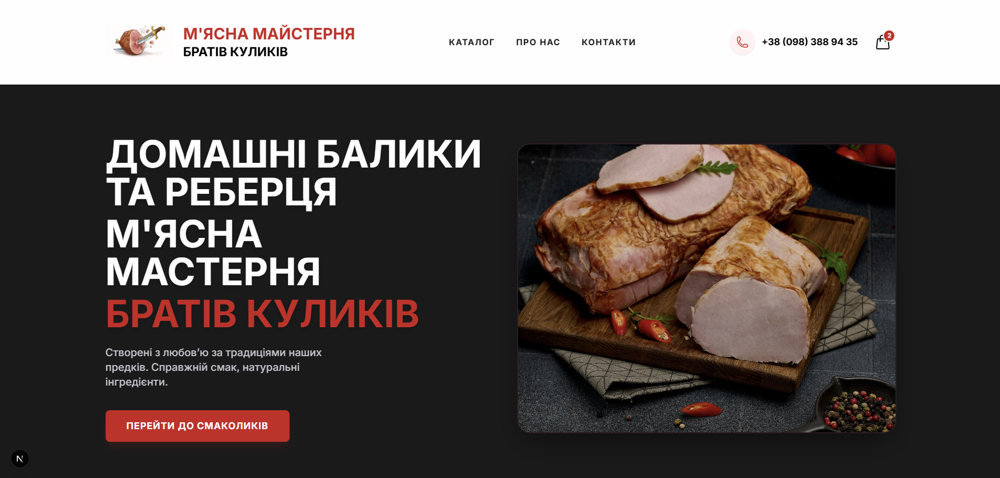

# 🥩 М'ясна Майстерня "Братів Куликів"

Сучасний E-commerce веб-сайт для сімейного бізнесу з продажу крафтових м'ясних делікатесів. Проект реалізовано з використанням **Next.js 14** для фронтенду та **Sanity.io** як Headless CMS для керування контентом.

## 🚀 Технологічний стек

- **Framework:** [Next.js 14](https://nextjs.org/) (App Router)
- **Language:** TypeScript
- **Styling:** [Tailwind CSS](https://tailwindcss.com/)
- **CMS (Database):** [Sanity.io](https://www.sanity.io/)
- **State Management:** React Context API (для кошика)
- **Forms & Validation:** React Hook Form / Custom validation
- **Notifications:** Telegram Bot API + Nodemailer (Email)
- **Deployment:** Vercel

## ✨ Функціонал

### Для клієнта:
- 🛍️ **Каталог товарів** з фільтрацією за категоріями.
- 🛒 **Кошик** (зберігається в LocalStorage, не зникає після оновлення).
- 📱 **Адаптивний дизайн** (Mobile-first).
- 📝 **Оформлення замовлення** з валідацією українського номера телефону (+380).
- 📍 **Контакти** з інтегрованою картою.

### Для адміністратора:
- 🔐 **Прихована адмін-панель** на сайті (`/admin`) із захистом PIN-кодом.
- 📦 **Перегляд замовлень** у реальному часі (статус, товари, сума).
- ✏️ **Зручне редагування товарів** через Sanity Studio (`/studio`).